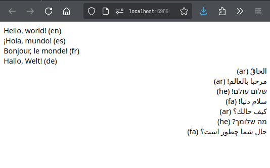

# Multilingual Database Project

This project demonstrates how to manage and display multilingual content using
a MariaDB database and PHP. It includes functionality to connect to the
database, retrieve content in multiple languages, and render it on a web page.

## Table of Contents

- [Features](#features)
- [Requirements](#requirements)
- [Installation](#installation)
- [Usage](#usage)
- [Database Dump](#database-dump)
- [License](#license)

## Features

- Connects to a MariaDB database.
- Supports multiple languages, including right-to-left languages.
- Displays content dynamically on a web page.
- Environment variables management using a `.env` file.

## Requirements

- PHP 7.0 or higher
- MariaDB or MySQL
- Web server (e.g., Apache, Nginx, or PHP built-in server)

## Installation

1. Clone the repository:

```bash
git clone https://github.com/nginr/multilingual-database-project.git
cd multilingual-database-project
```
2. Create a `.env` file in the root directory and add your database connection parameters: 

```.env
DB_HOST=localhost
DB_USERNAME=root
DB_PASSWORD=yourpassword
DB_DATABASE=multilang_db
```
3. Import the database schema and data from the `multilang_db_dump.sql` file: 

```bash
mysql -u root -p multilang_db < multilang_db_dump.sql
```

## Usage

1. Start the PHP built-in server:
```bash
php -S localhost:6969
```
2. Open your web browser and navigate to: `http://localhost:6969/index.php`

3. You should see the multilingual content displayed on the page. 


## Database Dump

The `multilang_db_dump.sql` file contains the SQL statements to recreate the
database and its contents. You can use this file to set up the database on your
local environment.
